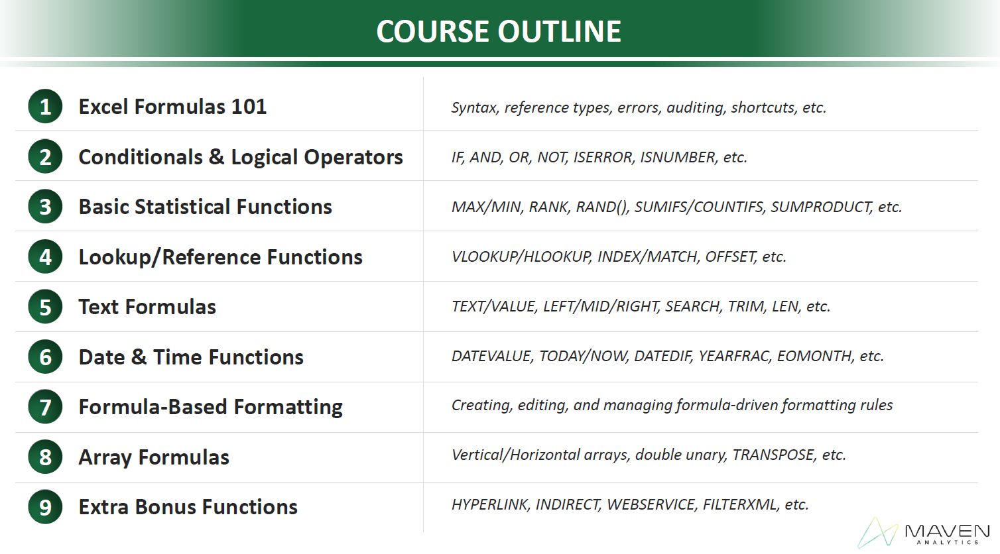
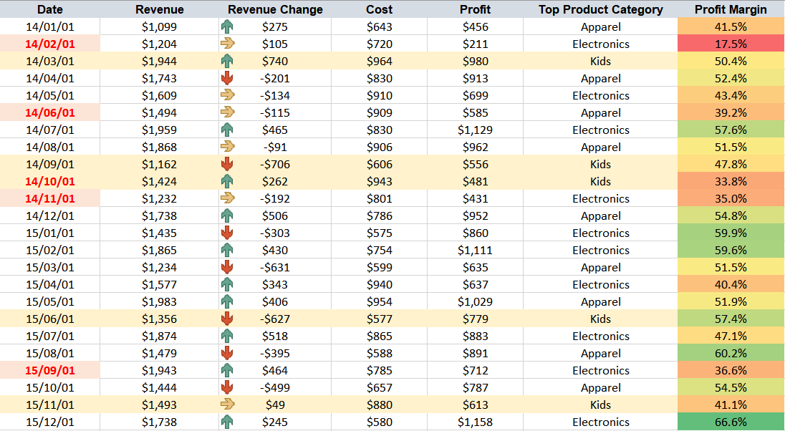
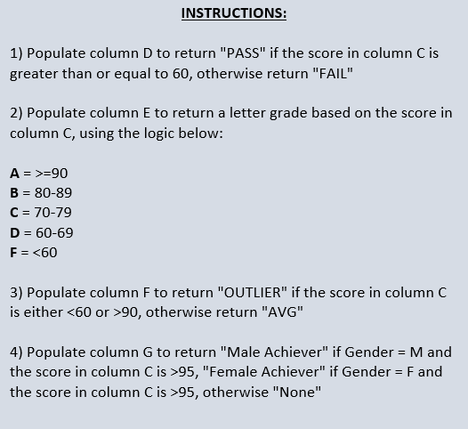
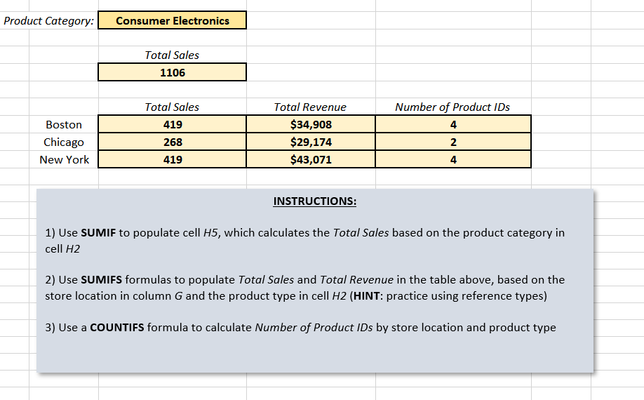
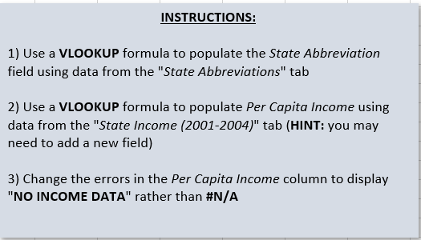
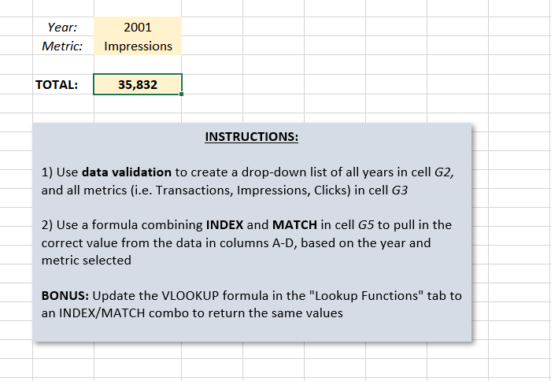
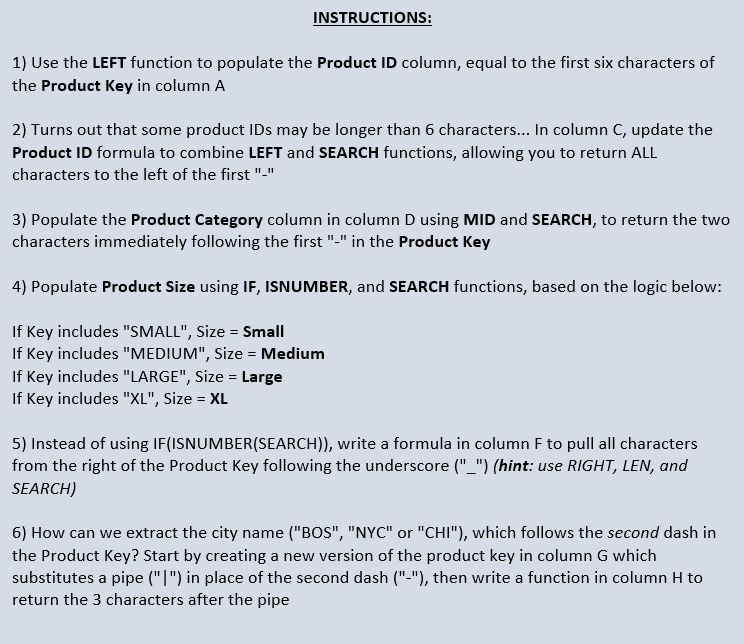

# Advanced_Excel_for_Analysts

## Purpose

The purpose of this repository is to practice Advanced funcations and formulas on MS Excel.

## Course Outline

## A. Formula 101

1. =IFERROR(C2/B2, "-")
2. =IFERROR(D2/$B2, "-")

## B. Logical Operators

1. =IF(C2>= 60, "Pass","Fail")
2. =IF(C2>= 90, "A", IF(C2 >= 80, "B", IF(C2>= 70, "C", IF(C2>=60, "D", "F"))))
3. =IF(OR(C2 <60, C2>90), "OUTLIER", "AVG")
4. =IF(AND(B2="M",C2>95),"Male Achiever",IF(AND(B2="F",C2>95),"Female Achiever","None"))

## C. Stats Functions

1. =SUMIF(A:A, $H$2, D:D)
2. =SUMIFS(D:D, $A:$A, $H$2, $C:$C, $G8)  ,  =SUMIFS(E:E, $A:$A, $H$2, $C:$C, $G8)
3. =COUNTIFS($A:$A, $H$2, $C:$C, $G8)

## D. Lookup Functions

1. =VLOOKUP(B2, 'State Abbreviations'!A:B, 2, 0)
2. =IFERROR(VLOOKUP(A2, 'State Income (2001-2004)'!A:D, 4, 0), "NO INCOME DATA")

## E. Index & Match Functions

1. =INDEX($A$1:$D$18, MATCH($G$2, A:A,0), MATCH($G$3,$A$1:$D$1, 0))

## F. OFFSET & COUNTA Functions

1. =COUNTA(A:A)-1
2. =OFFSET(A1, COUNTA(A:A)-1, 0,1,1)
3. =OFFSET(A1, COUNTA(A:A)-1, 1,1,1)
4. =SUM(OFFSET(B1, 0, 0, COUNTA(B:B),1))
5. =SUM(OFFSET(B1, 0, 0, COUNTA(B:B)-1, 1))

## G. Text Functions

1. =LEFT(A2,6)
2. =LEFT(A2, SEARCH("-", A2)-1)
3. =MID(A2,SEARCH("-",A2)+1, 2)
4. =IF(ISNUMBER(SEARCH("SMALL", A2)), "Small", IF(ISNUMBER(SEARCH("MEDIUM", A2)), "Medium",  IF(ISNUMBER(SEARCH("LARGE", A2)), "Large", IF(ISNUMBER(SEARCH("XL", A2)), "XL"))))
5. =RIGHT(A2, LEN(A2) - SEARCH("_", A2))
6. =SUBSTITUTE(A2, "-", "|", 2)
7. =MID(G2, SEARCH("|",G2)+1, 3)

## H. Date & Time Functions

1. =TODAY(),   =NOW()
2. =YEAR(C4), =MONTH(C4), =DAY(C4), =HOUR(C4), =MINUTE(C4),  =SECOND(C4)
3. =WEEKDAY(C4) --> Format Cells --> dddd
4. =WORKDAY(C3, 50)
5. =NETWORKDAYS(C2, C3)
6. =EOMONTH(C3,0)
7. =EOMONTH(C3,-1)+1
8. =EOMONTH(C3, MONTH(C3)* -1)+1

## I. Formula Formatting

